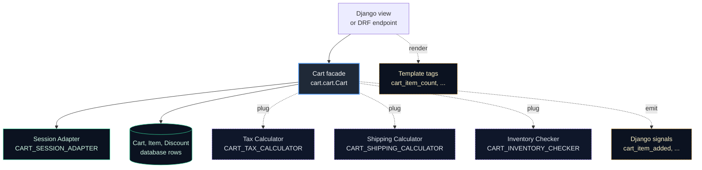
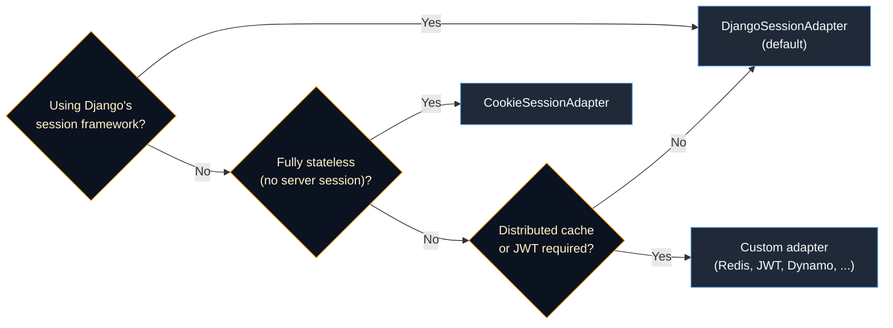
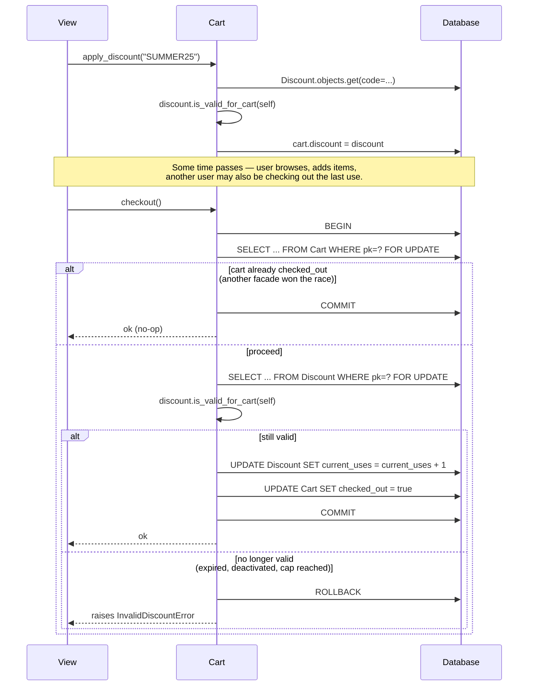
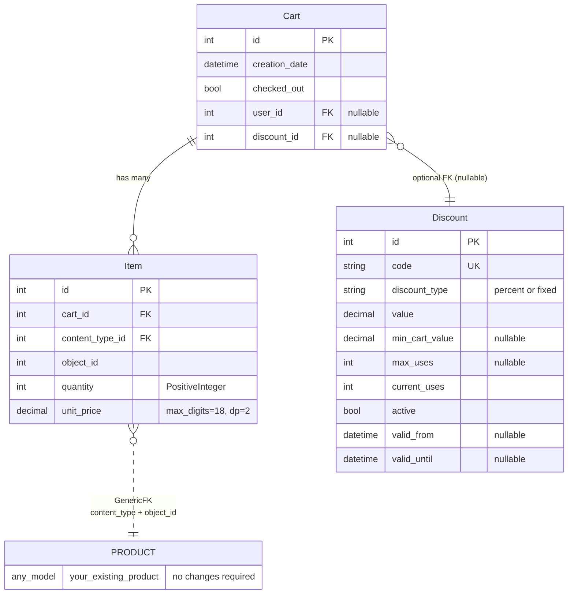

# django-cart

A lightweight, session-backed shopping cart for Django. One thin
`Cart` facade over one database row — plus pluggable subsystems for
tax, shipping, inventory, and session storage when you need them.

> [!tip] Why reach for django-cart
> - **Prototype-fast.** A working cart in three lines of view code and
>   a `pip install`. No schema changes to your product models.
> - **Small-store friendly.** Discounts, tax, and shipping ship in-box
>   and plug in through one setting each.
> - **Agent-ready.** The public API fits in one context window. Coding
>   agents (Claude, Cursor, Copilot) can generate correct extensions
>   on the first pass — see [`docs/AGENTS.md`](docs/AGENTS.md).



---

## Contents

**Get Started**

- [Installation](#installation)
- [Quick Start](#quick-start)
- [Using the Cart](#using-the-cart)
- [Discounts](#discounts)
- [Template Tags](#template-tags)
- [Admin Integration](#admin-integration)
- [Settings Reference](#settings-reference)

**Advanced**

- [Architecture](#architecture)
- [Pluggable Subsystems](#pluggable-subsystems)
- [Session Storage](#session-storage)
- [Signals](#signals)
- [Performance and Concurrency](#performance-and-concurrency)
- [Serialisation Format](#serialisation-format)
- [Data Model](#data-model)
- [Operations](#operations)
- [Agent-Ready](#agent-ready)
- [Testing django-cart](#testing-django-cart)
- [Requirements](#requirements)
- [Changelog, Roadmap, License](#changelog-roadmap-license)

---

## Installation

```bash
pip install django-cart
```

Add the app and run migrations. No changes to your product models are
required — `django-cart` uses `django.contrib.contenttypes` to attach
items to any model.

```python
# settings.py
INSTALLED_APPS = [
    # ...
    "django.contrib.contenttypes",  # already a Django default
    "cart",
]
```

```bash
python manage.py migrate cart
```

---

## Quick Start

A complete add-to-cart flow is three view functions and a template.

```python
# views.py
from decimal import Decimal
from django.shortcuts import get_object_or_404, redirect, render
from cart.cart import Cart
from shop.models import Product


def cart_add(request, product_id):
    product = get_object_or_404(Product, pk=product_id)
    Cart(request).add(product, unit_price=product.price, quantity=1)
    return redirect("cart_detail")


def cart_remove(request, product_id):
    product = get_object_or_404(Product, pk=product_id)
    Cart(request).remove(product)
    return redirect("cart_detail")


def cart_detail(request):
    return render(request, "cart/detail.html", {"cart": Cart(request)})
```

```html
{# cart/detail.html #}


    <p>Your cart is empty.</p>

    <ul>
      
        <li>{{ item.quantity }} × {{ item.product }} —
            {{ item.total_price }}</li>
      
    </ul>
    <p><strong>Total: {{ cart.summary }}</strong></p>

```

That's it. `Cart(request)` looks up (or creates) the cart row bound to
the current session, `.add()` creates a line item with a generic FK to
your `Product`, and the template iterates items with products preloaded.

---

## Using the Cart

### Adding, updating, removing

```python
from cart.cart import Cart, InvalidQuantity, ItemDoesNotExist

cart = Cart(request)

cart.add(product, unit_price=Decimal("12.00"), quantity=2)
cart.update(product, quantity=5)              # new quantity (0 removes)
cart.update(product, quantity=3, unit_price=Decimal("9.99"))
cart.remove(product)                          # raises ItemDoesNotExist
cart.clear()                                  # empties everything
```

All mutations are transactional and invalidate the internal cache.

### Bulk add

```python
cart.add_bulk([
    {"product": p1, "unit_price": Decimal("10.00"), "quantity": 2},
    {"product": p2, "unit_price": Decimal("20.00"), "quantity": 1},
])
```

### Inspecting the cart

```python
len(cart)              # total units
cart.count()           # same as len(cart)
cart.unique_count()    # number of distinct products
cart.is_empty()        # bool
product in cart        # bool
for item in cart: ...  # iterates items
```

Each `item` exposes `.product`, `.quantity`, `.unit_price`, and a
`.total_price` `Decimal` property.

For templates that render every product's name / image / SKU, prefer
`cart.items_with_products()` — it prefetches the concrete product rows
in one query per content type. Detail in
[Performance and Concurrency](#performance-and-concurrency).

### Money math

```python
cart.summary()          # Decimal — Σ quantity × unit_price
cart.tax()              # Decimal — uses configured TaxCalculator
cart.shipping()         # Decimal — uses configured ShippingCalculator
cart.discount_amount()  # Decimal — 0.00 if no discount applied
cart.total()            # Decimal — summary − discount + tax + shipping (2dp)
```

All six values are cached on the `Cart` instance and invalidated on
every mutation, so a template that renders subtotal + tax + shipping +
discount + total doesn't pay for re-computation or repeated calculator
calls.

### Checkout

```python
from cart.cart import CartException, InvalidDiscountError, MinimumOrderNotMet

try:
    cart.checkout()
except CartException:
    ...  # empty cart
except MinimumOrderNotMet:
    ...  # below settings.CART_MIN_ORDER_AMOUNT
except InvalidDiscountError:
    ...  # applied discount became invalid between apply and checkout
```

`checkout()` marks the cart `checked_out=True`. It's atomic,
idempotent (safe to retry), and race-safe at the `Cart` and `Discount`
row level — see [Performance and
Concurrency](#performance-and-concurrency) for the full model.
Inventory reservation is intentionally your own flow's job.

### User binding (on login)

Bind a guest cart to a user, and merge against any existing user cart:

```python
from cart.cart import Cart

def on_login(request):
    guest = Cart(request)
    prior = Cart.get_active_user_carts(request.user).first()

    if prior is None:
        guest.bind_to_user(request.user)
        return

    user_cart = Cart(request)
    user_cart.cart = prior
    user_cart.merge(guest, strategy="add")   # or "replace" / "keep_higher"
```

Use `get_active_user_carts()` for login/merge flows — it filters to
`checked_out=False` so you can't accidentally merge a past order.
`get_user_carts()` returns the full history (for order lists, admin
dashboards).

| Strategy | Result per product |
|----------|--------------------|
| `add` (default) | `quantity = old + new` |
| `replace` | `quantity = new` |
| `keep_higher` | `quantity = max(old, new)` |

### Save and restore

Freeze a cart to a JSON-safe dict and restore it on another request or
worker:

```python
payload = cart.cart_serializable()
restored = Cart.from_serializable(new_request, payload)
```

The applied discount code round-trips automatically. Format details and
the v3.0.13 key migration story are in
[Serialisation Format](#serialisation-format).

### Exceptions

All cart exceptions subclass `cart.cart.CartException`.

| Exception | Raised when |
|-----------|-------------|
| `InvalidQuantity` | quantity < 1 on `add`, < 0 on `update`, or > `CART_MAX_QUANTITY_PER_ITEM` |
| `ItemDoesNotExist` | `remove()` / `update()` called for a product not in the cart |
| `PriceMismatchError` | `validate_price=True` and `unit_price != product.price` |
| `InsufficientStock` | `check_inventory=True` and the configured `InventoryChecker.check()` returns `False` |
| `InvalidDiscountError` | bad code, already-applied discount, failed validity check, revalidation failure at checkout |
| `MinimumOrderNotMet` | `cart.summary() < settings.CART_MIN_ORDER_AMOUNT` at checkout |

---

## Discounts

Discount codes are first-class. The `Discount` model supports
percentage and fixed-amount discounts, validity windows, usage caps,
and minimum cart values.

```python
from decimal import Decimal
from cart.models import Discount, DiscountType

Discount.objects.create(
    code="SUMMER25",
    discount_type=DiscountType.PERCENT,
    value=Decimal("25.00"),
    min_cart_value=Decimal("50.00"),
    max_uses=500,
    valid_from=start_date,
    valid_until=end_date,
)
```

Apply, inspect, remove:

```python
from cart.cart import InvalidDiscountError

try:
    cart.apply_discount("SUMMER25")
except InvalidDiscountError as e:
    print(f"Cannot apply: {e}")

cart.discount_code()       # "SUMMER25"
cart.discount_amount()     # Decimal — computed against cart.summary()
cart.remove_discount()
```

`apply_discount()` validates the code (active, within its window, under
its usage cap, meets `min_cart_value`). `checkout()` re-validates under
a row-level lock and increments the usage counter atomically. Two
concurrent checkouts of the last available use result in exactly one
success and one `InvalidDiscountError`. See [Performance and
Concurrency](#performance-and-concurrency) for the full flow.

---

## Template Tags

```django

```

| Tag | Signature | Returns |
|-----|-----------|---------|
| `` | no arguments | integer |
| `` | no arguments | formatted string, e.g. `$19.98` |
| `` | no arguments | boolean |
| `` | `text`, `css_class` — both optional | HTML `<a>` tag |

All four tags declare `takes_context=True` and read `request` from the
template context (enabled by default when
`django.template.context_processors.request` is in `TEMPLATES → OPTIONS
→ context_processors`). Do not pass `request` positionally.

Typical header use:

```django


<header>
  <nav>
    <a href="/">Shop</a>
    
    <span class="badge"></span>
    <span class="total"></span>
  </nav>
</header>
```

The read-only tags (`cart_item_count`, `cart_summary`, `cart_is_empty`)
query the session directly — they do **not** create a cart row for
crawlers, bots, or logged-out visitors. `cart_link` resolves its URL
via `reverse(CART_DETAIL_URL_NAME)` when that setting is defined, and
falls back to a static `/cart/` otherwise.

Capture a value with `as`:

```django


  <span class="badge">{{ count }}</span>

```

---

## Admin Integration

`cart/admin.py` registers `Cart` with an inline `Item` editor, so you
can inspect a cart and its line items from one admin page. `Item` is
not registered as a top-level model (by design).

The `Discount` model is not registered by the library — storefronts
usually want a custom admin (bulk CSV import, campaign grouping,
voucher generators). Drop this in your own project:

```python
# myapp/admin.py
from django.contrib import admin
from cart.models import Discount


@admin.register(Discount)
class DiscountAdmin(admin.ModelAdmin):
    list_display = ("code", "discount_type", "value",
                    "current_uses", "max_uses", "active",
                    "valid_until")
    list_filter = ("active", "discount_type")
    search_fields = ("code",)
    readonly_fields = ("current_uses",)
```

---

## Settings Reference

All settings are optional. Defaults apply when a setting is absent or
`None`.

| Setting | Type | Default | Purpose |
|---------|------|---------|---------|
| `CART_TAX_CALCULATOR` | dotted path or class | `DefaultTaxCalculator` → `Decimal("0.00")` | Tax calculator class. See [Pluggable Subsystems](#pluggable-subsystems). |
| `CART_SHIPPING_CALCULATOR` | dotted path or class | `DefaultShippingCalculator` → `Decimal("0.00")`, one "free" option | Shipping calculator class. |
| `CART_INVENTORY_CHECKER` | dotted path or class | `DefaultInventoryChecker` → always `True` | Inventory checker class. |
| `CART_SESSION_ADAPTER` | dotted path or class | `DjangoSessionAdapter` | Where the integer cart id is stored. See [Session Storage](#session-storage). The legacy `CARTS_SESSION_ADAPTER_CLASS` is still honoured with a `DeprecationWarning` through v3.x. |
| `CART_MAX_QUANTITY_PER_ITEM` | int or `None` | `None` (unlimited) | Cap on `item.quantity`. Exceeding raises `InvalidQuantity`. |
| `CART_MIN_ORDER_AMOUNT` | `Decimal` or `None` | `None` (no minimum) | Minimum `cart.summary()` required for `checkout()` to succeed; below it, `checkout()` raises `MinimumOrderNotMet`. |
| `CART_DETAIL_URL_NAME` | str or `None` | `None` | URL name passed to `reverse()` by ``. Falls back to a static `/cart/` when unset or unresolvable. |

---

## Advanced

Everything below covers internals, extension points, operational
concerns, and edge cases. The sections above are enough to use
`django-cart` for common cases; reach here when you need to plug in
custom tax/shipping/inventory, wire custom session storage, understand
the concurrency model, or contribute to the library.

---

## Architecture

### The `Cart` facade

`cart.cart.Cart` is a thin wrapper around a single `cart.models.Cart`
row associated with the current session. The class holds two pieces
of state:

- `self.cart` — the DB row.
- `self._cache` — an in-memory cache for `count()`, `summary()`,
  `tax()`, `shipping()`, `discount_amount()`, and `total()`,
  invalidated on every mutation.

No hidden threads, no background work, no module-level registry.

### Items and generic foreign keys

Each `Item` references its product through `(content_type, object_id)`
— Django's
[contenttypes framework](https://docs.djangoproject.com/en/stable/ref/contrib/contenttypes/).
This is what lets `django-cart` work with **any** product model
without schema changes.

```python
cart.add(coffee_bean, Decimal("12.00"))        # Coffee model
cart.add(digital_course, Decimal("99.00"))     # Course model
# Same cart, different product classes.
```

### Session-backed lifecycle

```mermaid
flowchart LR
    classDef state fill:#0b1220,stroke:#60a5fa,color:#e2e8f0
    classDef money fill:#0b1220,stroke:#34d399,color:#d1fae5
    classDef final fill:#1f2937,stroke:#a78bfa,color:#f9fafb,stroke-width:2px

    Empty["Cart(request)<br>empty"]:::state
    Add["add(product, price)"]:::state
    Inspect["summary / count /<br>is_empty / iteration"]:::state
    Discount["apply_discount(code)"]:::money
    Math["tax() + shipping() −<br>discount_amount() → total()"]:::money
    Checkout["checkout()<br>atomic, idempotent"]:::final

    Empty --> Add
    Add --> Inspect
    Inspect --> Discount
    Discount --> Math
    Math --> Checkout
```



The only thing that lives in the HTTP session is the integer cart id.
Everything else is a database row. A cart survives page loads but does
not become an order — that is your checkout flow's responsibility.
`checkout()` marks the cart `checked_out=True` and (if a discount was
applied) bumps its usage counter atomically.

---

## Pluggable Subsystems

Tax, shipping, and inventory checking each follow the same shape: an
abstract base class, a no-op default, and a factory that reads a
dotted path from settings.

```
cart/<subsystem>.py:
    class <Subsystem>Base(ABC):              # your subclass inherits from this
    class Default<Subsystem>(Base):          # safe no-op default
    def get_<subsystem>() -> Base:           # factory, reads settings
```

> [!warning] Fallback on misconfiguration is a `RuntimeWarning`
> A bad dotted path in `CART_TAX_CALCULATOR`,
> `CART_SHIPPING_CALCULATOR`, or `CART_INVENTORY_CHECKER` falls back
> to the default implementation rather than raising — but each factory
> emits a `RuntimeWarning` naming the setting, the bad path, and the
> underlying `ImportError` / `AttributeError`. Promote those to errors
> in dev with `python -W error::RuntimeWarning` or Django's logging
> config. The session-adapter factory is the strict exception: it
> raises `ImportError` loudly.

### Tax

```python
# settings.py
CART_TAX_CALCULATOR = "myapp.tax.FlatRateTax"
```

```python
# myapp/tax.py
from decimal import Decimal
from cart.tax import TaxCalculator
from cart.cart import Cart


class FlatRateTax(TaxCalculator):
    def calculate(self, cart: Cart) -> Decimal:
        return cart.summary() * Decimal("0.08")
```

Usage:

```python
cart.tax()   # → Decimal
```

The default (`DefaultTaxCalculator`) always returns `Decimal("0.00")`.

### Shipping

`ShippingCalculator` has two methods: `calculate(cart)` for the total
cost, and `get_options(cart)` for the UI to show the user a list of
choices.

```python
# settings.py
CART_SHIPPING_CALCULATOR = "myapp.shipping.FlatRateShipping"
```

```python
# myapp/shipping.py
from decimal import Decimal
from cart.shipping import ShippingCalculator, ShippingOption
from cart.cart import Cart


class FlatRateShipping(ShippingCalculator):
    def calculate(self, cart: Cart) -> Decimal:
        return Decimal("0.00") if cart.summary() >= 100 else Decimal("9.99")

    def get_options(self, cart: Cart) -> list[ShippingOption]:
        return [
            ShippingOption(id="standard", name="Standard (3–5 days)",
                           price=str(self.calculate(cart))),
            ShippingOption(id="express", name="Express (next-day)",
                           price="19.99"),
        ]
```

```python
cart.shipping()          # → Decimal
cart.shipping_options()  # → list[dict]
```

### Inventory

Opt-in per-call with `check_inventory=True`:

```python
# settings.py
CART_INVENTORY_CHECKER = "myapp.inventory.StockChecker"
```

```python
# myapp/inventory.py
from cart.inventory import InventoryChecker


class StockChecker(InventoryChecker):
    def check(self, product, quantity: int) -> bool:
        return product.stock >= quantity

    def reserve(self, product, quantity: int) -> bool:
        # Atomic decrement; use F() in real code.
        if product.stock < quantity:
            return False
        product.stock -= quantity
        product.save(update_fields=["stock"])
        return True
```

```python
from cart.cart import InsufficientStock

try:
    cart.add(product, unit_price=p.price, quantity=5, check_inventory=True)
except InsufficientStock:
    return HttpResponseBadRequest("Not enough stock")
```

The default (`DefaultInventoryChecker`) always returns `True`.
`reserve()` is a method you call from your own checkout flow; the
library's `checkout()` does not call it — see
[Performance and Concurrency](#performance-and-concurrency).

---

## Session Storage

The only state the library puts in the HTTP session is the integer
`CART-ID`. Everything else is a database row. Which backend holds that
integer is configurable via a single setting.



### Built-in adapters

| Adapter | Use case |
|---------|----------|
| `DjangoSessionAdapter` (default) | Standard Django sessions (DB, cache, signed cookies — any `SESSION_ENGINE`). |
| `CookieSessionAdapter` | Fully stateless: stores the cart id in an HTTP cookie, reads it back on the next request. |

### Selecting an adapter

```python
# settings.py — dotted string
CART_SESSION_ADAPTER = "cart.session.CookieSessionAdapter"

# or — class object
from cart.session import CookieSessionAdapter
CART_SESSION_ADAPTER = CookieSessionAdapter
```

Both forms work. A typo in the dotted path raises `ImportError`
loudly — this is the one subsystem factory that does **not** fall back
silently.

> [!important] `CookieSessionAdapter` requires `CartCookieMiddleware`
> Any cookie-backed adapter needs `CartCookieMiddleware` in
> `MIDDLEWARE` so pending cookies are written to the response.
> `DjangoSessionAdapter` (the default) does not — Django's
> `SessionMiddleware` handles it.
>
> ```python
> MIDDLEWARE = [
>     # ... existing middleware ...
>     "cart.middleware.CartCookieMiddleware",
> ]
> ```

> [!note] Migrating from `CARTS_SESSION_ADAPTER_CLASS`
> v3.1.0 renamed this setting from the plural
> `CARTS_SESSION_ADAPTER_CLASS` to the singular `CART_SESSION_ADAPTER`
> for symmetry with the other `CART_*` settings. The legacy name is
> still honoured but emits a `DeprecationWarning` and will be removed
> in v4.0. If both are set, the new singular setting wins.

### Custom adapter

Subclass `CartSessionAdapter` and implement its five abstract methods:
`get` / `set` / `delete` / `get_or_create_cart_id` / `set_cart_id`.

```python
# myapp/session.py
from typing import Any
from cart.session import CartSessionAdapter
from cart.cart import CART_ID


class RedisSessionAdapter(CartSessionAdapter):
    def __init__(self, request):
        import redis
        self._r = redis.StrictRedis(host="localhost", port=6379, db=0)
        self._key = f"cart:{request.session.session_key}"

    def get(self, key: str, default: Any = None) -> Any:
        value = self._r.hget(self._key, key)
        return value.decode() if value else default

    def set(self, key: str, value: Any) -> None:
        self._r.hset(self._key, key, str(value))

    def delete(self, key: str) -> None:
        self._r.hdel(self._key, key)

    def get_or_create_cart_id(self) -> int | None:
        value = self.get(CART_ID)
        try:
            return int(value) if value else None
        except (ValueError, TypeError):
            return None

    def set_cart_id(self, cart_id: int) -> None:
        self.set(CART_ID, cart_id)
```

```python
# settings.py
CART_SESSION_ADAPTER = "myapp.session.RedisSessionAdapter"
```

See [`docs/AGENTS.md`](docs/AGENTS.md) for a prompt-ready version of
this pattern.

---

## Signals

Five optional signals let you observe cart events without
monkey-patching. Importing `cart.signals` is not required — if the
module is missing at import time, the cart still works and no signals
fire.

| Signal | Payload (`kwargs`) | Fired by |
|--------|---------------------|----------|
| `cart_item_added` | `cart`, `item` | `Cart.add()` on success |
| `cart_item_removed` | `cart`, `product` | `Cart.remove()` on success |
| `cart_item_updated` | `cart`, `item`, `deleted` (bool) | `Cart.update()` on success |
| `cart_checked_out` | `cart` | `Cart.checkout()` — only once per cart |
| `cart_cleared` | `cart` | `Cart.clear()` on success |

Wire handlers in your app's `ready()`:

```python
# myapp/apps.py
from django.apps import AppConfig


class MyAppConfig(AppConfig):
    name = "myapp"

    def ready(self):
        import myapp.signals  # noqa: F401
```

```python
# myapp/signals.py
from django.dispatch import receiver
from cart.signals import cart_item_added, cart_checked_out


@receiver(cart_item_added)
def record_add(sender, cart, item, **kwargs):
    # Analytics, audit log, inventory decrement, etc.
    ...


@receiver(cart_checked_out)
def send_confirmation(sender, cart, **kwargs):
    ...
```

---

## Performance and Concurrency

### Cached money-math methods

All six price-related methods — `summary()`, `count()`, `tax()`,
`shipping()`, `discount_amount()`, `total()` — are cached on the
`Cart` instance and cleared by `_invalidate_cache()` on every
mutation (`add`, `update`, `remove`, `clear`, `apply_discount`,
`remove_discount`, `merge`, checkout). A request-scoped render that
touches each method multiple times invokes the configured calculators
exactly once per `Cart` instance. For a typical tax calculator hitting
a remote API (Stripe Tax, Avalara, TaxJar), this cuts round-trips from
N to 1.

### Avoiding the N+1 on `.product`

Plain iteration (`for item in cart`) preloads `content_type` but
leaves `item.product` as a lazy lookup — touching `.product` on each
item in a template issues one SELECT per item. For render paths that
read the concrete product (name, image, SKU), use
`cart.items_with_products()`:

```python
for item in cart.items_with_products():
    # item.product is already prefetched — zero extra queries.
    ...
```

Under the hood it `select_related`s `content_type`, groups items by
it, and issues one `in_bulk` per distinct product model. A 100-item
cart across 3 product models drops from ~100 queries to 4.

### Concurrency on `add` / `update` / `merge`

`add()`, `update()`, and `merge()` are transactional but do **not**
hold row locks during their read phase. Under concurrent requests on
Postgres or MySQL, two workers that both read `quantity=N` can both
write `N+q`, clobbering one of the adds. For code paths that must be
concurrent-safe, wrap the mutation in your own `select_for_update()`
block or serialise upstream (idempotency keys, queue-per-cart, etc.).

`checkout()` itself is race-safe — see below.

### `checkout()` internals

`checkout()`:

- **Validates.** Calls `can_checkout()` before touching the DB
  (v3.1.0). Empty carts raise `CartException`; carts below
  `settings.CART_MIN_ORDER_AMOUNT` raise `MinimumOrderNotMet`.
- **Is atomic.** Marks the cart checked-out and (if a discount is
  applied) increments `Discount.current_uses` in the same transaction.
- **Is race-safe.** Takes a `SELECT … FOR UPDATE` on the `Cart` row
  first, then (when a discount is applied) on the `Discount` row. Two
  concurrent checkouts of the same cart produce exactly one counter
  increment; two concurrent checkouts of the last remaining use of a
  discount code result in one success and one `InvalidDiscountError`.
- **Is idempotent across facades.** Calling `checkout()` twice on the
  same cart — even from separate `Cart(request)` instances or workers
  with stale in-memory state — is a no-op on the second call. No
  second counter bump, no duplicate `cart_checked_out` signal.

> [!note] `checkout()` does not reserve inventory
> Stock reservation is the consuming project's responsibility. The
> `InventoryChecker` interface has a `reserve()` method you can call
> from your own checkout flow; the library's built-in `checkout()`
> does not call it. Reservation semantics (timeout, release on failed
> payment, retry) vary too much per project to bake a default.

### Discount usage-cap enforcement



Two concurrent checkouts of the last remaining use of a discount code
result in exactly one success and exactly one `InvalidDiscountError`.
The counter is never exceeded.

---

## Serialisation Format

```python
payload = cart.cart_serializable()
# {"7:42": {"content_type_id": 7, "object_id": 42, "quantity": 2,
#           "unit_price": "9.99", "total_price": "19.98"},
#  "__discount__": {"code": "SUMMER25"}}
```

Item keys are `"<content_type_id>:<object_id>"` composites. The
reserved `__discount__` key carries the applied discount's code (absent
when no discount is applied). `from_serializable()` restores items by
the composite identity and reattaches the `Discount` row if one is
still present in the DB (silently skipped if the referenced discount
has been deleted between serialise and restore).

> [!important] Pre-v3.0.13 payload compatibility
> v3.0.13 changed the key shape from `str(object_id)` to
> `"content_type_id:object_id"` so two products with the same PK
> across different content types no longer collide.
> `from_serializable()` accepts both formats — payloads stored before
> v3.0.13 keep working as long as each value carries `content_type_id`
> (introduced in v3.0.11). Consumers that used to iterate keys to pull
> `object_id` should read it from the value (emitted explicitly since
> v3.0.13).

---

## Data Model

Three models, one generic FK, a handful of indexes.



`Item` has `unique_together` on `(cart, content_type, object_id)` and
a composite index on the same triple — so `cart.add(p)` is always one
primary-key lookup.

---

## Operations

### Pruning abandoned carts

Abandoned carts accumulate. The `clean_carts` management command
removes them:

```bash
python manage.py clean_carts                    # default: unchecked-out, >90 days old
python manage.py clean_carts --days 30          # custom retention
python manage.py clean_carts --days 30 --dry-run
python manage.py clean_carts --days 60 --include-checked-out
```

Schedule with cron:

```cron
# Nightly at 02:00
0 2 * * * /path/to/venv/bin/python /path/to/project/manage.py clean_carts --days 30
```

Or Celery:

```python
# myapp/tasks.py
from celery import shared_task
from django.core.management import call_command


@shared_task
def prune_abandoned_carts():
    call_command("clean_carts", days=30)
```

---

## Agent-Ready

`django-cart` is designed to be **extended by coding agents on the
first pass**. Three properties make that possible:

1. **Small surface.** The public API is under 1000 lines across four
   files and fits entirely in a single agent context window.
2. **Explicit extension points.** Every subsystem is a settings
   dotted-path pointing at a subclass of a clearly-typed abstract
   base. No registries, no decorators, no magic.
3. **Stable contracts.** Public names are preserved across patch and
   minor releases. The same prompt that works today works on the next
   minor.

A minimum working example — generating a custom tax calculator with
Claude:

```text
Prompt:

  In my Django project I use django-cart. Generate a TaxCalculator
  subclass that applies 7.25% tax if the cart's `summary()` is
  above $100 and 5% otherwise. Wire it in through settings and
  write a pytest that asserts both branches.

Expected output:
  - myapp/tax.py with `class Tiered(TaxCalculator)` returning Decimal
  - settings.py with CART_TAX_CALCULATOR set to its dotted path
  - tests/test_tax.py with two test functions exercising both branches
```

For the full agentic extension guide — prompt templates, review
checklist, sharp edges, verification steps — see
**[`docs/AGENTS.md`](docs/AGENTS.md)**.

---

## Testing django-cart

> [!note] Contributors only
> This section is for working **on** the library. Application code
> consuming `django-cart` does not need any of this.

`django-cart` uses `pytest` + `pytest-django` exclusively — there is
no `unittest.TestCase` subclassing, no `runtests.py`. Fixtures live in
`tests/conftest.py`; helpers are never defined inside test files.

```bash
uv venv
uv pip install -e ".[dev]"
uv run pytest
```

Run a single file or test:

```bash
uv run pytest tests/test_cart_add.py
uv run pytest tests/test_cart_add.py::test_add_new_product_stores_the_quantity
```

Coverage:

```bash
uv run coverage run -m pytest
uv run coverage report            # advisory floor: 90% (local only)
uv run coverage html               # → htmlcov/
```

See [`tests/README.md`](tests/README.md) for the full test pattern,
fixture catalogue, and guidance on writing behavioural (not
reflection) tests.

---

## Requirements

**Python 3.10+, Django 4.2+.**

### Compatibility matrix

|              | Django 4.2 | Django 5.0 | Django 5.1 | Django 6.0 |
|--------------|:----------:|:----------:|:----------:|:----------:|
| Python 3.10  |     ✅     |     ✅     |     ✅     |      —     |
| Python 3.11  |     ✅     |     ✅     |     ✅     |      —     |
| Python 3.12  |     ✅     |     ✅     |     ✅     |     ✅     |
| Python 3.13  |     ✅     |     ✅     |     ✅     |     ✅     |
| Python 3.14  |     ❌     |     ❌     |     ❌     |     ✅     |

- ✅ exercised in CI.
- ❌ unsupported — see the callout below.
- — this Python version is outside the upstream Django release's
  supported Python range.

> [!warning] **Python 3.14 requires Django 6.0+**
> `django-cart` does **not** support Python 3.14 paired with Django
> 4.2, 5.0, or 5.1 — and will not. The incompatibility is upstream in
> Django itself.
>
> **Why it breaks.** Django's `django.template.Context.__copy__`
> (pre-6.0) assigns `duplicate.dicts = self.dicts[:]` onto a value
> returned by `copy(super())`, i.e. a `super()` proxy. Python 3.14 no
> longer permits attribute assignment on `super()` proxies, so any
> template render under Py3.14 + Django<6 raises
> `AttributeError: 'super' object has no attribute 'dicts' and no
> __dict__ for setting new attributes`.
>
> Django fixed `Context.__copy__` in 6.0. There is nothing
> `django-cart` can patch on its side — the break is in Django's
> template engine, not in this library.
>
> **What to do.** On Python 3.14, upgrade to Django 6.0+. On earlier
> Django, stay on Python 3.13 or below.

---

## Changelog, Roadmap, License

- **Changelog:** [`CHANGELOG.md`](CHANGELOG.md) — Keep-a-Changelog
  format.
- **Analysis and remediation plan:**
  [`docs/ANALYSIS.md`](docs/ANALYSIS.md) — bug-by-bug priorities,
  design gaps, and the suggested per-release scope.
- **License:** MIT. See [`LICENSE`](LICENSE). (Relicensed from
  LGPL-3.0 in v3.0.11 — see `CHANGELOG.md`.)

A roadmap slot is reserved for cryptocurrency-style fractional
quantities — tiny fractions of a product (e.g. a `Coin` model)
denominated in long decimals with satoshi- or wei-level precision. The
cart stays a collection of `(product, quantity, unit_price)` triples;
only the numeric precision changes. Design doc required before
implementation. Scope marker, not a commitment —
[`docs/ANALYSIS.md`](docs/ANALYSIS.md) tracks broader prioritisation.

Contributions welcome. The library is small on purpose — if a feature
fits the "session-backed cart" mission, open an issue or PR. For
experimental or speculative work, prefer a downstream package that
extends `django-cart` via its public API rather than forking.
